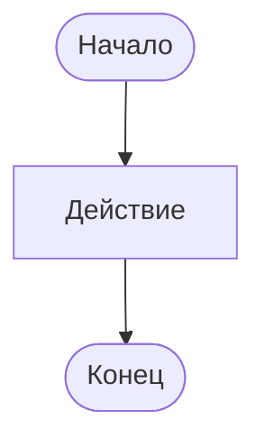

# Бизнес-процесс: [наименование]

## Реквизиты

| Параметр | Значение |
| --- | --- |
| Владелец процесса | [ФИО / должность] |
| Участники | [роли] |
| Границы процесса | [событие начала — событие окончания] |
| Системы | [1С:ERP, 1С:УТ и др.] |
| Версия | 0.1 |

## Цель процесса

[Какую бизнес-задачу решает процесс и какой измеримый результат создаёт.]

## Процесс «как есть» (AS IS)

### Шаги

| № | Роль | Действие | Система / документ | Результат | Проблема / риск |
| ---: | --- | --- | --- | --- | --- |
| 1 |  |  |  |  |  |

### Схема

## Процесс «как должно быть» (TO BE)

### Шаги

| № | Роль | Действие | Система / документ | Результат | Контроль |
| ---: | --- | --- | --- | --- | --- |
| 1 |  |  |  |  |  |

### Схема

## Изменения

| Область | AS IS | TO BE | Связанное требование |
| --- | --- | --- | --- |
|  |  |  | REQ-001 |

## Показатели процесса

| Показатель | Текущее значение | Целевое значение | Способ измерения |
| --- | --- | --- | --- |
|  |  |  |  |
