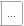
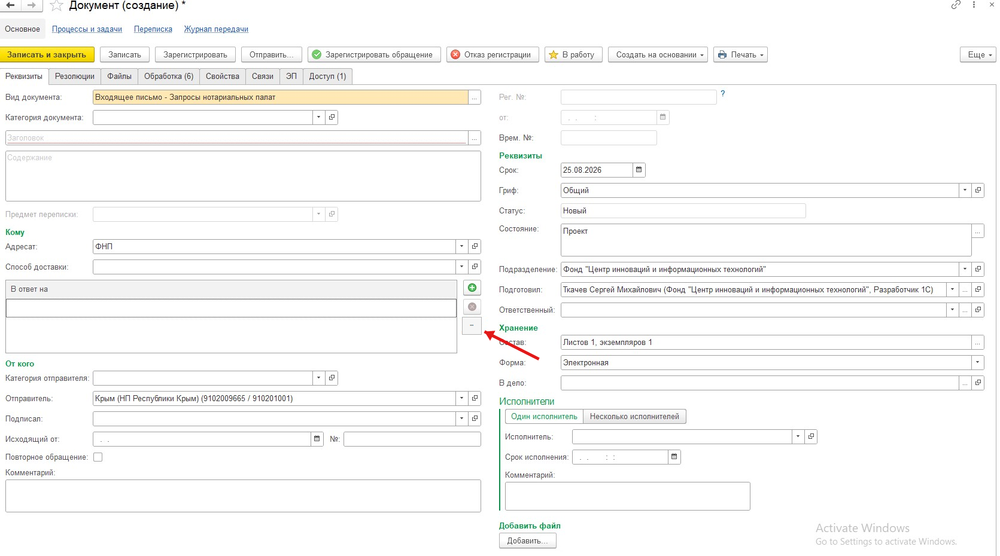
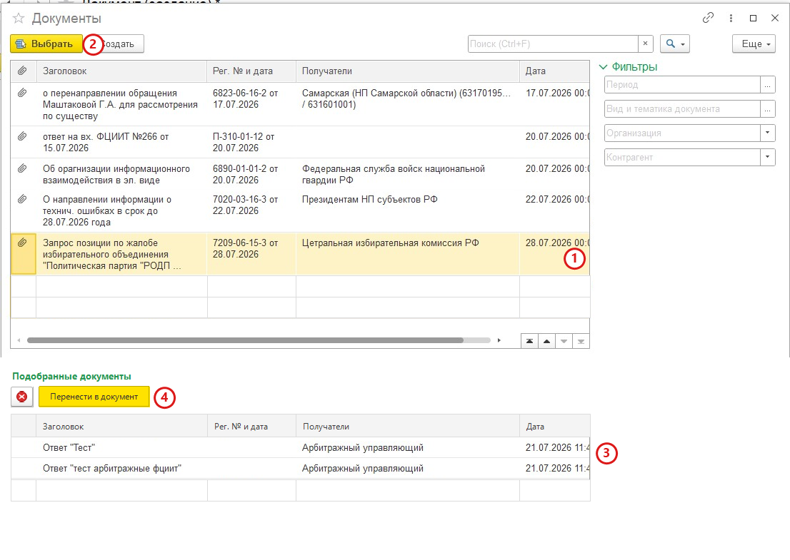

# Множественный выбор писем-оснований

## История версий

| Версия | Подготовил | Описание                                                                                                                                                                                                            |
| ------------ | -------------------- | --------------------------------------------------------------------------------------------------------------------------------------------------------------------------------------------------------------------------- |
| 2026-07-31   | —                   | Начальная версия листа требований                                                                                                                                                             |
| 2026-08-01   | —                   | Уточнены область применения, критерии отбора видов документов, повторное открытие формы, добавление документов и завершение подбора |

## Общая информация

### Сокращения, термины

| N | Сокращение/термин             | Описание                                                                                                                                                                                       |
| - | --------------------------------------------- | ------------------------------------------------------------------------------------------------------------------------------------------------------------------------------------------------------ |
| 1 | 1С                                           | Информационная система, в которой выполняется доработка                                                                                               |
| 2 | Письмо-основание               | Документ, на который оформляемый документ является ответом                                                                                          |
| 3 | ТЧ                                          | Табличная часть формы или документа                                                                                                                                     |
| 4 | «В ответ на»                        | Табличная часть документа, содержащая письма-основания                                                                                                 |
| 5 | «Подобранные документы» | Новая табличная часть формы подбора для временного хранения выбранных документов до их переноса в документ |
| 6 | Форма подбора                     | Форма со списком доступных документов, используемая для выбора писем-оснований                                                     |

### Область применения

Доработка распространяется на документы, для которых предусмотрено заполнение писем-оснований. Такими документами являются документы с видом из справочника «Документы», у которого установлен хотя бы один из реквизитов: «Является входящей корреспонденцией» или «Является исходящей корреспонденцией».

## Предпосылки для выполнения работ

Текущий механизм заполнения писем-оснований требует от пользователя предварительно переключить режим ввода, а затем добавлять значения по одному. Для каждого следующего значения необходимо повторно открывать форму выбора.

Кнопка переключения режима ввода одного/нескольких писем-оснований и кнопка «+» неочевидны для пользователей. Последовательное добавление по одному значению увеличивает количество действий и затрудняет работу с несколькими письмами-основаниями.

## Концепция реализации

Отказаться от двух отдельных режимов ввода писем-оснований. Для всех документов по умолчанию отображать ТЧ «В ответ на» и предоставить единый сценарий группового подбора через кнопку .

Форму подбора дополнить нижней ТЧ «Подобранные документы». Пользователь последовательно формирует в ней набор писем-оснований, при необходимости корректирует его, после чего одной командой переносит все подобранные документы в ТЧ «В ответ на» текущего документа.

Отдельная защита от повторного подбора не требуется. После подбора документ перемещается из верхней ТЧ доступных документов в нижнюю ТЧ «Подобранные документы» и перестаёт отображаться в верхней ТЧ. Пока документ находится в нижней ТЧ, повторно выбрать его невозможно.

Доработка изменяет представление и пользовательский сценарий формы подбора. При этом не изменяются существующие правила доступности документов, состав сохраняемых данных и механизм хранения связей с письмами-основаниями. Доработка не влияет на печатные формы, маршруты согласования, обмен данными и другие интеграции.

## Описание процесса as is

В текущем интерфейсе предусмотрены два режима ввода писем-оснований:

- ввод одного письма-основания;
- ввод нескольких писем-оснований.

По умолчанию пользователю доступен режим ввода одного письма-основания. Переключение выполняется отдельной кнопкой режима ввода одного/нескольких писем-оснований на форме документа.

После включения режима ввода нескольких писем на форме документа отображается ТЧ «В ответ на» для добавления документов. Добавление выполняется следующим образом:

1. Пользователь нажимает кнопку «+» в ТЧ «В ответ на».
2. Система открывает форму выбора.
3. Пользователь выбирает один документ.
4. Выбранное значение добавляется в ТЧ «В ответ на».
5. Для добавления следующего документа пользователь повторно нажимает «+» и заново выполняет выбор.

За одну итерацию пользователь может добавить только один документ. Форма выбора закрывается после выбора значения, поэтому для формирования списка необходимо многократно повторять одинаковые действия.

## Описание процесса to be

### Отображение писем-оснований в документе

ТЧ «В ответ на» располагается на вкладке «Реквизиты» и отображается по умолчанию на форме всех документов, в которых предусмотрено заполнение писем-оснований. Переключение между режимами ввода одного и нескольких писем-оснований не используется.

На форме документа вместо кнопки переключения режимов размещается кнопка , открывающая форму подбора документов.

### Подбор документов

1. Пользователь нажимает кнопку  на форме документа.
2. Система открывает форму подбора. Документы, уже содержащиеся в ТЧ «В ответ на» текущего документа, не отображаются ни в верхней ТЧ доступных документов, ни в нижней ТЧ «Подобранные документы».
3. В верхней части формы пользователь просматривает, ищет и фильтрует доступные документы.
4. Пользователь выделяет требуемый документ и нажимает «Выбрать» либо дважды щёлкает по строке документа.
5. Система переносит выбранный документ из верхней ТЧ в нижнюю ТЧ «Подобранные документы». После переноса документ перестаёт отображаться в верхней ТЧ и не может быть выбран повторно. Форма подбора остаётся открытой.
6. Пользователь повторяет подбор до формирования полного набора документов.
7. При необходимости пользователь выделяет ошибочно подобранные документы и нажимает кнопку . Система возвращает их из нижней ТЧ в верхнюю ТЧ доступных документов.
8. Кнопка «Перенести в документ» становится доступной после добавления в ТЧ «Подобранные документы» хотя бы одного документа. Пока нижняя ТЧ пуста, кнопка недоступна.
9. Пользователь нажимает кнопку «Перенести в документ».
10. Система добавляет все строки из ТЧ «Подобранные документы» к документам, уже содержащимся в ТЧ «В ответ на» текущего документа. Ранее добавленные строки не заменяются и не удаляются.
11. После успешного переноса система очищает ТЧ «Подобранные документы» и закрывает форму подбора. Сообщение об успешном переносе не выводится.

## Описание доработки

### Форма документа

1. Доработку выполнить для видов документов из справочника «Документы», у которых установлен хотя бы один из реквизитов:
   - «Является входящей корреспонденцией»;
   - «Является исходящей корреспонденцией».
2. ТЧ «В ответ на» должна располагаться на вкладке «Реквизиты» и отображаться на форме по умолчанию для всех документов с видами, соответствующими условию пункта 1. Наличие хотя бы одного из указанных реквизитов означает, что для документа предусмотрено заполнение писем-оснований.
3. Кнопку переключения между режимами ввода одного и нескольких писем-оснований убрать с формы документа.
4. Вместо кнопки переключения режимов разместить кнопку .
5. По нажатию кнопки  открывать форму подбора со списком доступных документов.
6. Сохранить существующую возможность удаления выбранных строк непосредственно из ТЧ «В ответ на» на форме документа.

### Форма подбора документов

1. В верхней части формы сохранить существующую ТЧ со списком доступных документов и предусмотренные в ней возможности просмотра, поиска и фильтрации.
2. В нижней части формы добавить ТЧ «Подобранные документы».
3. Состав, наименования, порядок и представление колонок нижней ТЧ «Подобранные документы» должны быть аналогичны колонкам верхней ТЧ доступных документов.
4. По нажатию кнопки «Выбрать» или двойным щелчком по строке переносить выбранный пользователем документ из верхней ТЧ в нижнюю ТЧ «Подобранные документы».
5. После переноса документа в ТЧ «Подобранные документы» исключать его из отображения в верхней ТЧ доступных документов. Отдельную проверку или предупреждение о повторном подборе не добавлять, поскольку перемещение между таблицами исключает возможность повторного выбора.
6. После переноса документов в ТЧ «Подобранные документы» не закрывать форму подбора. Пользователь должен иметь возможность продолжить поиск и подбор.
7. При открытии формы подбора исключать из обеих ТЧ формы все документы, уже содержащиеся в ТЧ «В ответ на» текущего документа.
8. Добавить кнопку «Перенести в документ».
9. Кнопка «Перенести в документ» должна быть недоступна, если ТЧ «Подобранные документы» пуста, и становиться доступной при наличии в ней хотя бы одного документа.
10. По нажатию кнопки «Перенести в документ» добавлять все строки из ТЧ «Подобранные документы» к строкам, уже содержащимся в ТЧ «В ответ на» текущего документа. Существующие строки не заменять и не удалять.
11. После успешного переноса очищать ТЧ «Подобранные документы» и закрывать форму подбора без вывода сообщения пользователю.
12. Добавить кнопку .
13. По нажатию кнопки  возвращать выделенные пользователем документы из нижней ТЧ «Подобранные документы» в верхнюю ТЧ доступных документов.
14. Возврат документа из ТЧ «Подобранные документы» не должен удалять сам документ из системы.
15. До переноса в документ пользователь должен видеть полный перечень подобранных документов и иметь возможность скорректировать его.
16. Сохранить существующие правила доступности документов, поиска, фильтрации и сохранения связи с письмами-основаниями.

### Влияние на смежные сущности и процессы

Доработка не должна изменять печатные формы, маршруты согласования, механизмы обмена данными и другие интеграции. Существующие правила доступности документов, состав сохраняемых данных и механизм хранения связей с письмами-основаниями остаются без изменений.

### Критерии приёмки

#### Форма документа

- Доработка применяется к видам документов из справочника «Документы» с установленным реквизитом «Является входящей корреспонденцией» или «Является исходящей корреспонденцией».
- ТЧ «В ответ на» располагается на вкладке «Реквизиты» и отображается по умолчанию для документов, у вида которых установлен реквизит «Является входящей корреспонденцией» или «Является исходящей корреспонденцией».
- На форме документа отсутствует кнопка переключения режима ввода одного/нескольких писем-оснований.
- На форме размещена кнопка .
- По нажатию кнопки открывается форма подбора со списком доступных документов и нижней ТЧ «Подобранные документы».
- Пользователь может удалить выбранное письмо-основание непосредственно из ТЧ «В ответ на» на форме документа.

#### Подбор документов

- Пользователь может за один сеанс подобрать не менее двух документов.
- Нижняя ТЧ «Подобранные документы» содержит колонки, аналогичные колонкам верхней ТЧ по составу, наименованию, порядку и представлению.
- По нажатию кнопки «Выбрать» или двойным щелчком мыши выбранный документ переносится из верхней ТЧ в ТЧ «Подобранные документы».
- После переноса в ТЧ «Подобранные документы» документ перестаёт отображаться в верхней ТЧ и не может быть выбран повторно.
- После переноса документа форма подбора остаётся открытой.
- Пользователь видит все подобранные документы и может продолжить поиск и подбор.
- При повторном открытии формы документы, уже содержащиеся в ТЧ «В ответ на», отсутствуют как в верхней, так и в нижней ТЧ формы подбора.
- При пустой ТЧ «Подобранные документы» кнопка «Перенести в документ» недоступна.
- После добавления хотя бы одного документа в ТЧ «Подобранные документы» кнопка «Перенести в документ» становится доступной.

#### Корректировка подобранных документов

- Пользователь может выделить один или несколько документов в ТЧ «Подобранные документы».
- По нажатию кнопки  выделенные документы возвращаются в верхнюю ТЧ доступных документов.
- Возврат строк из ТЧ «Подобранные документы» не удаляет документы из системы.

#### Перенос в документ

- По нажатию кнопки «Перенести в документ» все строки из ТЧ «Подобранные документы» добавляются к существующим строкам ТЧ «В ответ на» текущего документа.
- Ранее добавленные строки ТЧ «В ответ на» при переносе не заменяются и не удаляются.
- После успешного переноса нижняя ТЧ «Подобранные документы» очищается, а форма подбора закрывается.
- При успешном переносе сообщение пользователю не выводится.
- После сохранения и повторного открытия документа перенесённые письма-основания остаются заполненными.
- Для добавления нескольких писем-оснований не требуется многократно открывать форму по кнопке «+».

#### Итоговая проверка

- Пользователь может заполнить одно или несколько писем-оснований в рамках единого сценария.
- Существующие правила доступности, поиска и фильтрации документов сохранены.
- Связи документа со всеми перенесёнными письмами-основаниями сохраняются корректно.
- Печатные формы, маршруты согласования, обмен данными и другие интеграции работают без изменений.
