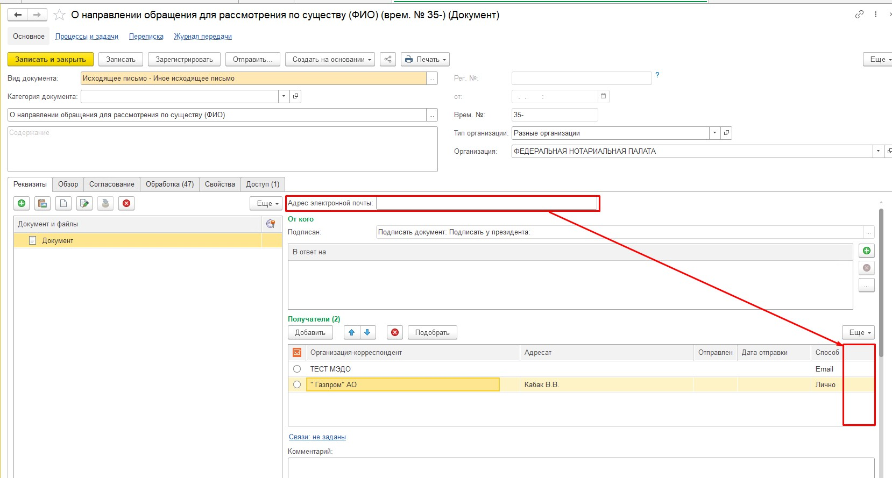

# Адрес электронной почты в исходящей корреспонденции

## Текущий процесс (AS IS)

В документах вида «Исходящее письмо», для которых признак «Является исходящей корреспонденцией» установлен в значение «Истина», используется нетиповой реквизит «Адрес электронной почты».

Указанный в реквизите адрес электронной почты используется для отправки писем.

Реквизит вынесен на форму документа: `Данные → Страницы → Реквизиты → Элемента → ФНП_ГруппаПравая → ФНП_ГруппаСтраницы → ФНП_СтраницаРеквизиты → Лево`.

Реквизит отображается, если в первой строке табличной части «Контрагенты» в поле «Способ» указано значение `Email`.

## Требуемая доработка (TO BE)

Перенести реквизит «Адрес электронной почты» в табличную часть «Контрагенты» и разместить его после колонки «Способ».

Изменить пользовательское отображение реквизита на «Адрес Email».

Колонку «Адрес электронной почты» отображать, если хотя бы в одной строке табичной части в поле «Способ» указано значение `Email`.

При выборе значения `Email` в поле «Способ» автоматически заполнять адрес электронной почты:

1. Первым не пустым значением email из карточки контактного лица, указанного в поле «Адресат».
2. Если email контактного лица не заполнен или не указано само контактное лицо в документе — первым заполненным значением email из карточки контрагента, указанного в поле «Организация-корреспондент».
3. Если email не заполнен ни у контактного лица, ни у контрагента — оставлять поле пустым.

Существующий механизм отправки письма на указанные email сохранить без изменений.

